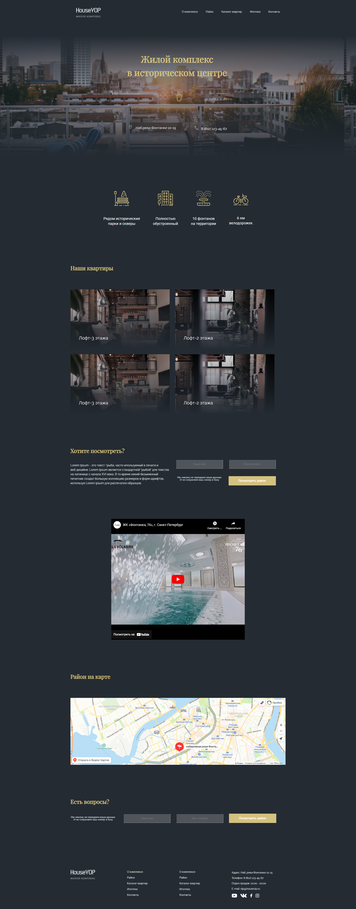

<h1>Residential-complex-project</h1>

<h2>Description</h2>
Одностраничный сайт жилого комплекса

Ссылка на сайт:   https://vladmir26.github.io/Residential-complex-project/ 

Используемые технологии: 
- HTML5,
- CSS3,
- семантическая верстка,
- Flexbox,
- БЭМ,
- адаптивная верстка с использованием медиа-выражений

Ниже представлен скриншот проекта:

